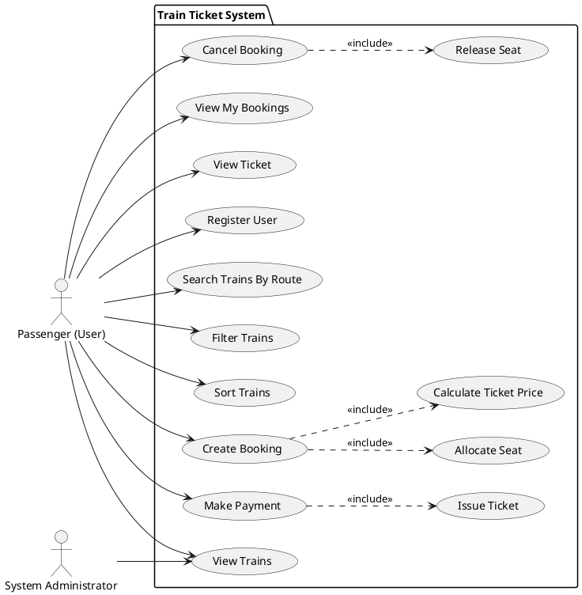
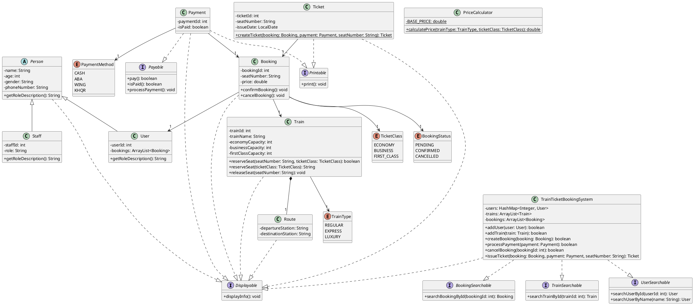
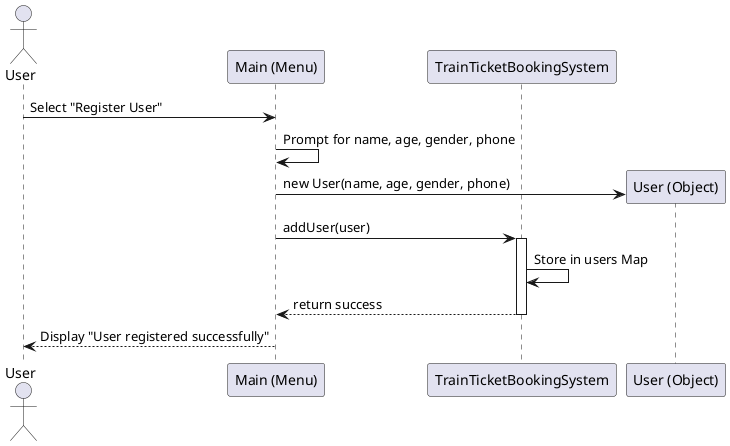
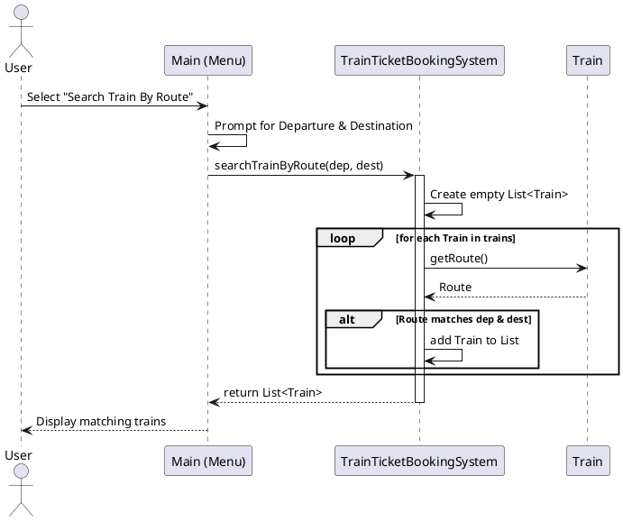
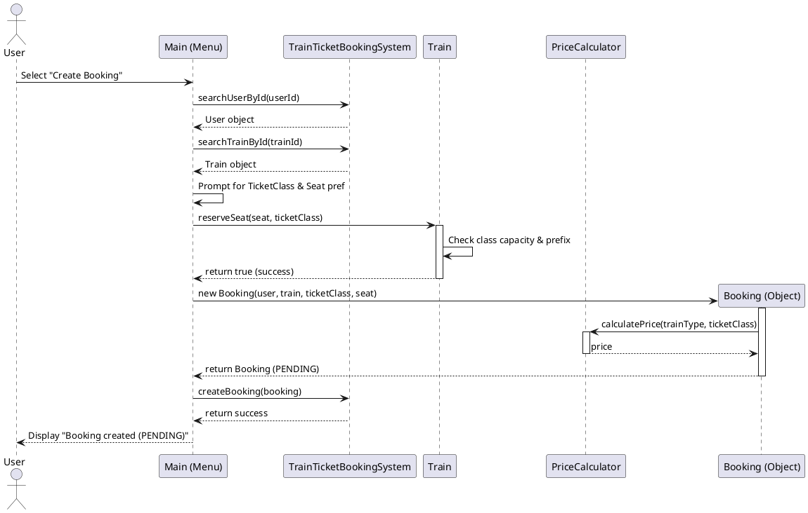
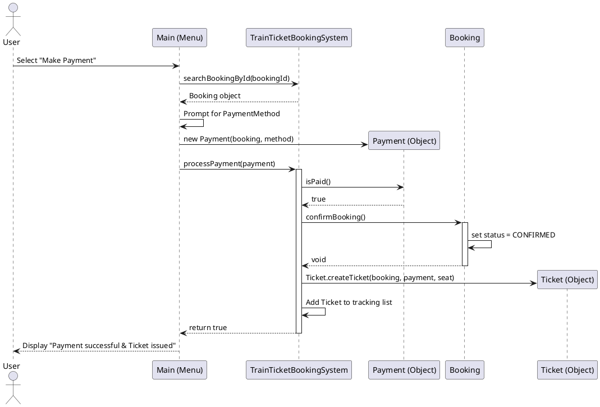
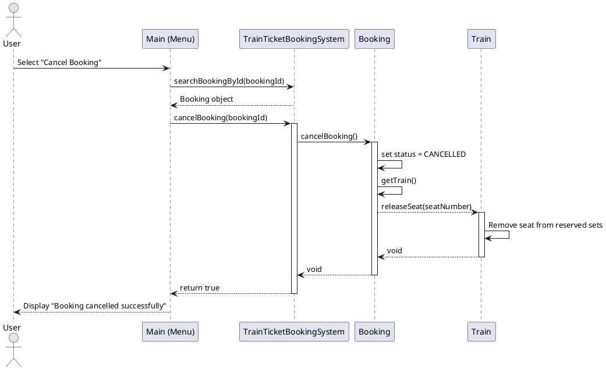

# Train Ticket System — QA Analysis & UML Diagrams

As a Senior QA Analyst, Business Analyst, and System Reviewer, I have reviewed the proposed architecture and flows for the Train Ticket System. Before development or further iterations begin, it is critical to address several systemic gaps, ambiguities, and edge cases.

---

## 1. System Understanding

Based on the proposed design, the system functions as a console-based, point-to-point railway reservation manager.

**End-to-End Flow:**
1. A **User** registers by providing basic details (name, age, gender, phone) and receives a unique User ID.
2. The user browses pre-seeded **Trains** that operate on static **Routes**.
3. The user initiates a **Booking** for a specific Train and `TicketClass`. A seat is allocated, and the `PriceCalculator` determines the cost. The booking is placed in a `PENDING` state, locking the seat.
4. The user completes a **Payment** using an external-simulated method (CASH, ABA, WING, KHQR).
5. Upon successful payment, the Booking transitions to `CONFIRMED`, and a **Ticket** is automatically issued.
6. The user can cancel the booking at any time (`PENDING` or `CONFIRMED`), which releases the seat back to the train.

**System Boundaries:**
- The system lacks external integrations (no real payment gateway, no database).
- There is no authentication layer; the system relies on manual User ID entry.

---

## 2. Clarification Questions

### User Lifecycle
* **Authentication:** How does a user securely log back in? Currently, anyone knowing a `userId` can view or cancel bookings.
* **Updates:** Can a user update their phone number or name if they make a mistake?
* **Duplication:** What prevents a user from registering 10 times with the exact same name and phone number?
* **Deletion:** Is there a process for users to delete their accounts (GDPR/privacy compliance)? If so, what happens to their past financial transactions?

### Train & Route Lifecycle
* **Schedules:** Trains have a `Route` but no departure dates or times. Is a train considered a physical vehicle, or a scheduled trip? If a user books "Star Express", what day are they traveling?
* **Dynamic Changes:** Who manages trains? Can an administrator add or remove trains dynamically?
* **Intermediate Stops:** The `Route` assumes strictly point-to-point travel. What if the train stops at multiple stations? Can a user book a partial leg of the journey?

### Booking Lifecycle
* **Cart Abandonment:** A `PENDING` booking locks a seat. If a user closes the console before paying, does the seat remain locked forever?
* **Group Bookings:** Can a user book 3 seats at once, or do they have to go through the booking menu 3 separate times?
* **Modification:** Can a user change their seat or upgrade their class after a booking is created but before payment?

### Payment & Ticket Lifecycle
* **Refunds:** The system allows cancelling a `CONFIRMED` (paid) booking. How is the refund processed? Is it manual, or does the system need to track refund states?
* **Ticket Reissuance:** If a user loses their ticket ID, can they regenerate the ticket from their booking?

---

## 3. Missing Requirements & Business Rules

1. **Booking Timeout Rule:** There must be a TTL (Time-to-Live) for `PENDING` bookings (e.g., 15 minutes). If unpaid, the system must auto-cancel them and release the seats to prevent deadlocks.
2. **Travel Dates & Times:** A massive missing component. Bookings need a `travelDate` and `departureTime`. A single `Train` object currently acts as an infinite capacity vehicle without time constraints.
3. **Refund Policy:** A business rule must dictate what happens when a paid booking is cancelled. (e.g., "Full refund if >24 hours, 50% refund otherwise").
4. **Data Persistence:** The system resets entirely on exit. A requirement for database or file storage must be defined before production.
5. **Partial Payments / Overpayments:** Rules defining strict matching of payment amounts to booking prices are missing.

---

## 4. Potential Design Problems & Edge Cases

* **Concurrency Issues:** In a multi-user environment, two users might try to auto-reserve the last seat simultaneously. The seat allocation must be thread-safe.
* **Orphan Records:** If a Train is deleted by an admin, existing Bookings linked to that Train object will have dangling references or corrupt data.
* **State Transition Bypass:** Code must guarantee that a `CANCELLED` booking cannot be magically paid for or confirmed later.
* **Idempotency:** Paying for the same booking twice should be strictly blocked by the system.

---

# UML Deliverables

Below are the PlantUML diagrams defining the finalized understanding of the system. You can copy these blocks directly into a PlantUML viewer.

### 1. Use Case Diagram

---

### 2. Class Diagram

---

### 3. Sequence Diagrams

#### A. Sequence Diagram — Register User

#### B. Sequence Diagram — Search Train By Route

#### C. Sequence Diagram — Create Booking

#### D. Sequence Diagram — Make Payment

#### E. Sequence Diagram — Cancel Booking

