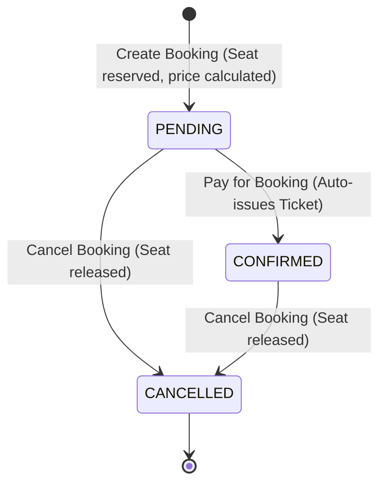

# TrainTicketSystem — OOP Concept Review & Project State

> Reviewed on: 2026-06-23  
> Reviewer: Expert Java Code Review & System Architecture Update  
> Branch: `main`

---

## Project Overview & Architecture

The Train Ticket System is a console-based railway reservation system written in Java. It is designed using strong Object-Oriented Programming (OOP) principles, clean encapsulation, type-safe enums, and decoupled packages.

A booking-centric architecture is employed where the `Booking` class acts as the central coordinator of transactions:
1. **User** searches for trains, filters them, or sorts them.
2. **User** makes a reservation, generating a `Booking` in `PENDING` status.
3. The booking automatically assigns a seat within the chosen `TicketClass` and calculates the price via the static `PriceCalculator` engine.
4. **Payment** completes the transaction using a selected `PaymentMethod`, changing the booking status to `CONFIRMED` and automatically issuing a `Ticket`.
5. At any time, a `PENDING` or `CONFIRMED` booking can be cancelled, releasing the reserved seat back to the train.

---

## Project File Structure

```
TrainTicketSystem/
├── enums/
│   ├── BookingStatus.java             [NEW] - PENDING, CONFIRMED, CANCELLED
│   ├── PaymentMethod.java             [NEW] - CASH, ABA, WING, KHQR
│   ├── TicketClass.java               [NEW] - ECONOMY, BUSINESS, FIRST_CLASS
│   └── TrainType.java                 [NEW] - REGULAR, EXPRESS, LUXURY
├── exceptions/
│   └── TicketIssuanceException.java   - Checked exception for guard rail validation
├── interfaces/
│   ├── BookingSearchable.java         - Interface contract for searching bookings
│   ├── Displayable.java               - Interface contract for displaying info
│   ├── Payable.java                   - Interface contract for payment actions (uses default method)
│   ├── Printable.java                 - Interface contract for printing ticket/invoice details
│   ├── TrainSearchable.java           - Interface contract for searching trains
│   └── UserSearchable.java            - Interface contract for searching users
├── model/
│   ├── Booking.java                   [UPDATED] - Booking status, class, and seat control
│   ├── Payment.java                   [UPDATED] - Encapsulated payment state and validation
│   ├── Person.java                    [UPDATED] - Now an abstract base class
│   ├── Route.java                     [NEW] - Departure/destination value object (Displayable)
│   ├── Staff.java                     - Subclass of Person representing employees
│   ├── Ticket.java                    [UPDATED] - Encapsulates confirmation, composition, and issueDate
│   ├── Train.java                     [UPDATED] - Multi-class seat tracker, delegate getters
│   └── User.java                      [UPDATED] - Subclass of Person representing customers
├── service/
│   └── PriceCalculator.java           [NEW] - Centralized price multiplier engine
└── main/
    ├── Main.java                      [UPDATED] - Interactive 11-option console menu
    └── TrainTicketBookingSystem.java  [UPDATED] - Central system coordinator (no BookingService)
```

---

## 1. Encapsulation

**✅ YES — Correctly and fully implemented**

### Where
All model classes (`Person`, `User`, `Staff`, `Train`, `Booking`, `Payment`, `Ticket`, `Route`), enums, utility services (`PriceCalculator`), and the controller coordinator `TrainTicketBookingSystem`.

### Why It Qualifies
Every field is declared `private` (or `protected` in `Person` for inherited subclass access), and access is controlled through public getters and setters. Setters perform strict guard validation (e.g., rejecting negative ages, handling empty/null input, matching seat prefixes to their classes, preventing double payment, and returning read-only defensive copies of internal lists).

### Evidence

```java
// Person.java — fields hidden, guarded setters
protected String name;
protected int    age;

public void setAge(int age) {
    this.age = (age > 0) ? age : 0;          // guard: rejects negative ages
}

// Train.java — internal lists/maps are encapsulated; defensive copies are returned
private ArrayList<Booking> bookings;

public ArrayList<Booking> getBookingsCopy() {
    return new ArrayList<>(bookings);         // prevents external mutation of system state
}

// Route.java — self-contained destination verification
public void setDestinationStation(String destinationStation) {
    String cleaned = (destinationStation == null) ? "" : destinationStation.trim();
    if (cleaned.isEmpty()) {
        this.destinationStation = "Unknown Destination";
    } else if (cleaned.equalsIgnoreCase(this.departureStation)) {
        this.destinationStation = "Invalid Destination"; // prevents circular routes
    } else {
        this.destinationStation = cleaned;
    }
}
```

---

## 2. Static

**✅ YES — Correctly implemented**

### Where
`User`, `Staff`, `Train`, `Booking`, `Payment`, `Ticket` — all model classes; and the service utility `PriceCalculator`.

### Why It Qualifies
1. **Auto-Increment ID Generators**: `nextUserId`, `nextTrainId`, `nextBookingId`, etc., are class-level variables shared across all instances to guarantee unique serial IDs.
2. **Count Trackers**: `userCount`, `trainCount`, etc., track total instantiations statically.
3. **Static Factory Method**: `Ticket.createTicket(...)` validates preconditions before calling the constructor, separating instantiation logic from validation.
4. **Static Pricing Utility**: `PriceCalculator.calculatePrice(...)` provides global access to business pricing rules without state persistence.

### Evidence

```java
// Ticket.java — static factory method
public static Ticket createTicket(Booking booking, Payment payment, String seatNumber) {
    if (booking == null) return null;
    if (payment == null || !payment.isPaid()) return null;
    return new Ticket(booking, seatNumber);
}

// PriceCalculator.java — static calculation rules
private static final double BASE_PRICE = 10.0;

public static double calculatePrice(TrainType trainType, TicketClass ticketClass) {
    double trainMultiplier = (trainType != null) ? trainType.getPriceMultiplier() : 1.0;
    double classMultiplier = (ticketClass == TicketClass.BUSINESS) ? 1.75 : (ticketClass == TicketClass.FIRST_CLASS ? 2.5 : 1.0);
    double raw = BASE_PRICE * trainMultiplier * classMultiplier;
    return Math.round(raw * 100.0) / 100.0;
}
```

---

## 3. Interface

**✅ YES — Correctly implemented and actively used**

### Where
`interfaces/` package: `Displayable`, `Payable`, `Printable`, `BookingSearchable`, `TrainSearchable`, `UserSearchable`.

### Why It Qualifies
Interfaces define essential behavioral contracts implemented by different domain components. This decouples references—for example, the payment process takes any `Payable` implementation (currently `Payment`), and search operations rely on specific interfaces implemented by `TrainTicketBookingSystem`. `Payable` also utilizes a `default` Java 8+ method to declare fallback logic.

### Evidence

```java
// Payable.java — with default method
public interface Payable {
    boolean pay();
    boolean isPaid();
    default void processPayment() { pay(); }   // default implementation
}

// TrainTicketBookingSystem.java — implements search contracts
public class TrainTicketBookingSystem
    implements Displayable, UserSearchable, TrainSearchable, BookingSearchable { ... }
```

### Interface Implementation Map

| Interface | Implemented By | Description |
| :--- | :--- | :--- |
| `Displayable` | `Person`, `Train`, `Booking`, `Payment`, `Ticket`, `TrainTicketBookingSystem`, `Route` | Forces objects to implement a standard terminal printout format. |
| `Payable` | `Payment` | Handles checking/execution of payment transactions. |
| `Printable` | `Payment`, `Ticket` | Prints printable slips like receipts and tickets. |
| `BookingSearchable`| `TrainTicketBookingSystem` | Contract for querying system bookings. |
| `TrainSearchable` | `TrainTicketBookingSystem` | Contract for querying system trains. |
| `UserSearchable` | `TrainTicketBookingSystem` | Contract for querying registered users. |

---

## 4. Inheritance

**✅ YES — Correctly implemented**

### Where
- `User extends Person`
- `Staff extends Person`
- `User implements Comparable<User>`
- `Booking implements Comparable<Booking>`

### Why It Qualifies
`Person` is the abstract base class that holds common fields (`name`, `age`, `gender`, `phoneNumber`) and shares basic validation logic. `User` (adding `userId` and custom `bookings` collection) and `Staff` (adding `staffId` and `role`) inherit all properties, invoking `super(...)` constructors to delegate initialization logic to the base class.

### Evidence

```java
// User.java — extends Person and Comparable
public class User extends Person implements Comparable<User> {
    private int userId;
    private ArrayList<Booking> bookings;

    public User(String name, int age, String gender, String phoneNumber) {
        super(name, age, gender, phoneNumber);   // invokes Person constructor
        this.userId = nextUserId++;
        this.bookings = new ArrayList<>();
    }
}
```

---

## 5. Method Overriding

**✅ YES — Correctly implemented with `@Override` annotations**

### Where
Subclasses and interface-implementing classes across the project.

### Why It Qualifies
The `@Override` annotation is consistently used to signal that a method replaces a superclass/interface implementation. Polymorphism invokes the correct subclass method version at runtime based on the actual object type.

### Evidence

```java
// User.java — overrides abstract method from Person
@Override
public String getRoleDescription() {
    return "Registered User";
}

// User.java — overrides displayInfo() from Person/Displayable
@Override
public void displayInfo() {
    System.out.println("User ID       : " + userId);
    super.displayInfo(); // calls parent Person's displayInfo()
    System.out.println("Role          : " + getRoleDescription());
    System.out.println("Total Bookings: " + bookings.size());
}

// Route.java — overrides Object methods
@Override
public boolean equals(Object obj) {
    if (this == obj) return true;
    if (!(obj instanceof Route)) return false;
    Route other = (Route) obj;
    return Objects.equals(this.departureStation, other.departureStation) &&
           Objects.equals(this.destinationStation, other.destinationStation);
}
```

---

## 6. Method Overloading

**✅ YES — Correctly and extensively implemented**

### Where
`Person`, `User`, `Train`, `Booking`, `Payment`, `TrainTicketBookingSystem`.

### Why It Qualifies
Multiple methods/constructors share the same name but differ in their parameter list (types, number, or order). This allows flexibility in object creation and method invocation (e.g., booking with specific seats vs automatic allocation).

### Evidence

```java
// Train.java — three variations of reserveSeat
public boolean reserveSeat(String seatNumber, TicketClass ticketClass) { ... } // 1. specific seat & class validation
public boolean reserveSeat(String seatNumber) { ... }                          // 2. legacy single-arg validation (prefix inferred)
public String reserveSeat(TicketClass ticketClass) { ... }                      // 3. automatic seat allocation returns seat label

// Booking.java — constructor overloads
public Booking(User user, Train train, TicketClass ticketClass, String seatNumber) { ... }
public Booking(User user, Train train, String travelDate) { ... }               // legacy string date
public Booking(User user, Train train, LocalDate travelDate) { ... }            // legacy localdate
```

---

## 7. Polymorphism

**✅ YES — Correctly implemented (both compile-time and runtime)**

### Where
`Main.java` loops, method arguments, search lookups, interface references.

### Why It Qualifies
1. **Compile-time Polymorphism**: Method overloading resolves the exact signature at compile time.
2. **Runtime Polymorphism**: Polymorphic collections and interfaces are declared with high-level types (`Displayable`, `Person`, `Payable`). The program iterates over these interfaces, invoking overridden implementations at runtime without checking the concrete subclass.

### Evidence

```java
// Main.java — iterating over polymorphic Displayable types
ArrayList<Displayable> displayables = new ArrayList<>();
displayables.add(user1);      // User (subclass of Person, implements Displayable)
displayables.add(train1);     // Train (implements Displayable)
displayables.add(route1);     // Route (implements Displayable)
displayables.add(booking1);   // Booking (implements Displayable)

for (Displayable item : displayables) {
    item.displayInfo();       // dynamically dispatched to correct class implementation
}

// Main.java — iterating over polymorphic Person references
ArrayList<Person> people = new ArrayList<>();
people.add(user);
people.add(staff);
for (Person p : people) {
    System.out.println(p.getName() + " is a " + p.getRoleDescription()); // User and Staff return different values
}
```

---

## 8. Abstraction

**✅ YES — Implemented via interfaces and abstract classes**

### Where
All 6 interfaces and the `Person` abstract class.

### Why It Qualifies
Abstraction defines **what** operations must be performed rather than **how** they are completed. For instance, `TrainTicketBookingSystem` acts as the service manager implementing the search interfaces; callers only interact with search functions through interface references, hiding internal data storage (`HashMap`, `ArrayList`) from the view layers.

### Evidence

```java
// Payable contract acts as an abstraction for Payments
Payable payable = payment;
system.processPayment(payment); // system processes payment polymorphically
System.out.println("Payment status: " + payable.isPaid());
```

---

## 9. Abstract Class

**✅ YES — Correctly implemented**

### Where
[Person.java](file:///Users/phokphallaoudom/Documents/GitHub/TrainTicketSystem/model/Person.java) — declared as an abstract base class.
[User.java](file:///Users/phokphallaoudom/Documents/GitHub/TrainTicketSystem/model/User.java) and [Staff.java](file:///Users/phokphallaoudom/Documents/GitHub/TrainTicketSystem/model/Staff.java) — concrete subclasses.

### Why It Qualifies
`Person` cannot be instantiated directly and serves as a template. It defines the abstract method `public abstract String getRoleDescription();`. The compiler forces all subclasses (`User`, `Staff`) to implement this method or also be declared abstract.

### Evidence

```java
public abstract class Person implements Displayable {
    protected String name;
    protected int age;
    // ...
    public abstract String getRoleDescription(); // abstract template method
}
```

---

## 10. Exception Handling

**✅ YES — Correctly implemented with custom checked exception**

### Where
- `exceptions/TicketIssuanceException.java` — custom checked exception class
- `main/TrainTicketBookingSystem.java` — `issueTicket()` declares `throws`
- `main/Main.java` — `try-catch` blocks handle errors gracefully.

### Why It Qualifies
A custom checked exception subclassing `Exception` is defined. Methods validating domain rules throw this exception when constraints are violated (e.g., ticket class full, seat prefix mismatch, booking already paid). Callers in the console layer must handle this exception via `try-catch` blocks, preventing the program from crashing and ensuring friendly alerts are displayed.

### Evidence

```java
// exceptions/TicketIssuanceException.java
public class TicketIssuanceException extends Exception {
    public TicketIssuanceException(String message) { super(message); }
}

// TrainTicketBookingSystem.java
public Ticket issueTicket(Booking booking, Payment payment, String seatNumber) 
        throws TicketIssuanceException {
    if (booking == null) 
        throw new TicketIssuanceException("Ticket issuance failed: booking cannot be null.");
    if (!payment.isPaid())
        throw new TicketIssuanceException("Ticket issuance failed: payment is not completed.");
    if (!booking.getTrain().isSeatAvailable(seatNumber))
        throw new TicketIssuanceException("Ticket issuance failed: seat is already reserved.");
    // ...
    return new Ticket(booking, seatNumber);
}

// Main.java — Try-Catch handling
try {
    Ticket ticket = system.issueTicket(booking, payment, seat);
    ticket.print();
} catch (TicketIssuanceException e) {
    System.out.println("System Error: " + e.getMessage()); // Graceful error recovery
}
```

---

## Domain Logic & Sub-Systems

### 1. Pricing Engine (`PriceCalculator`)
The price of a ticket is computed dynamically according to the formula:
$$\text{Ticket Price} = \text{BASE\_PRICE } (\$10.00) \times \text{TrainType Multiplier} \times \text{TicketClass Multiplier}$$

#### Multiplier Rules:
- **TrainType**:
  - `REGULAR`: $1.0\times$
  - `EXPRESS`: $1.5\times$
  - `LUXURY` : $2.0\times$
- **TicketClass**:
  - `ECONOMY`    : $1.0\times$
  - `BUSINESS`   : $1.75\times$
  - `FIRST_CLASS`: $2.5\times$

#### Pricing Matrix Summary:
| Train Type / Ticket Class | ECONOMY | BUSINESS | FIRST_CLASS |
| :--- | :--- | :--- | :--- |
| **REGULAR** (Multiplier: 1.0) | \$10.00 | \$17.50 | \$25.00 |
| **EXPRESS** (Multiplier: 1.5) | \$15.00 | \$26.25 | \$37.50 |
| **LUXURY** (Multiplier: 2.0) | \$20.00 | \$35.00 | \$50.00 |

---

### 2. Booking & Ticket Lifecycle



- **PENDING**: Initial state. A seat is held, and the price is calculated, but no ticket is active.
- **CONFIRMED**: Payment successfully processed. A `Ticket` object is created with an `issueDate`.
- **CANCELLED**: The booking is canceled. The seat is released back to the train's available capacity.

---

### 3. Seat Allocation & Class Capacity
Seats are validated by prefix character:
- `ECONOMY`: Prefix `E` (e.g., `E1`, `E2`)
- `BUSINESS`: Prefix `B` (e.g., `B1`, `B2`)
- `FIRST_CLASS`: Prefix `F` (e.g., `F1`, `F2`)

When booking:
- The system checks if the seat label matches the prefix of the selected `TicketClass`.
- It verifies that the train has not exceeded the maximum capacity for that specific class.
- The train supports auto-assigning the next available numbered seat (e.g., finding the first unreserved seat with prefix `E` for `ECONOMY`).

---

## Interactive Console Menu & Seed Data

The user interfaces with the application through `Main.java` using a command line menu system containing the following options:

1. **Register User**: Registers a new customer under the system.
2. **View All Trains**: Displays all active trains, routes, types, base price, and capacity profiles.
3. **Search Train By Route**: Filters trains matching a specified Departure and Destination station.
4. **Filter Trains**: Filters the list of trains by `TrainType` (Regular, Express, Luxury) or seat class availability (`ECONOMY`, `BUSINESS`, `FIRST_CLASS`).
5. **Sort Trains**: Sorts trains by Economy Base Price (ascending), Total Available Seats (descending), or Train Type (Regular → Express → Luxury).
6. **Create Booking**: reserves a seat (custom or auto-assigned) for a registered user on a train, moving the status to `PENDING`.
7. **Make Payment**: Processes a payment for a `PENDING` booking using `CASH`, `ABA`, `WING`, or `KHQR`, updating the status to `CONFIRMED` and automatically generating a ticket.
8. **Cancel Booking**: Cancels a `PENDING` or `CONFIRMED` booking, freeing up the reserved seat.
9. **View My Bookings**: Prints the booking history of a registered user.
10. **View Ticket**: Displays details of a ticket issued for a booking.
11. **Exit**: Terminates the application.

### Pre-loaded Seed Data (Trains)
The application starts pre-seeded with the following 5 train setups:
1. **Star Express** — `EXPRESS` train from **Phnom Penh** to **Siem Reap**. Capacity: 30 Economy, 10 Business, 5 First Class.
2. **Kingdom Rail** — `REGULAR` train from **Phnom Penh** to **Battambang**. Capacity: 40 Economy, 15 Business, 5 First Class.
3. **Royal Luxury** — `LUXURY` train from **Siem Reap** to **Sihanoukville**. Capacity: 20 Economy, 10 Business, 5 First Class.
4. **Mekong Express** — `EXPRESS` train from **Phnom Penh** to **Kampot**. Capacity: 25 Economy, 10 Business, 5 First Class.
5. **Local Shuttle** — `REGULAR` train from **Battambang** to **Poipet**. Capacity: 50 Economy, 0 Business, 0 First Class.

---

## OOP Concept Summary Table

| # | OOP Concept | Implemented? | Primary Location(s) | Notes |
| :--- | :--- | :--- | :--- | :--- |
| 1 | **Encapsulation** | ✅ YES | All model classes, enums, `PriceCalculator`, `TrainTicketBookingSystem` | All fields are private/protected; validation occurs in constructors/setters. |
| 2 | **Static** | ✅ YES | `User`, `Staff`, `Train`, `Booking`, `Payment`, `Ticket`, `PriceCalculator` | Auto-increment IDs, count trackers, static factory method (`Ticket.createTicket()`), static calculator logic. |
| 3 | **Interface** | ✅ YES | `interfaces/` (6 files), `Payment`, `TrainTicketBookingSystem`, `Route` | Contract layouts defining display, print, pay, and search actions. |
| 4 | **Inheritance** | ✅ YES | `User extends Person`, `Staff extends Person` | Extends attributes and behavior. Uses superclass constructors via `super(...)`. |
| 5 | **Method Overriding** | ✅ YES | Models, `Route`, `TrainTicketBookingSystem` | `@Override` overrides methods like `displayInfo()`, `toString()`, `equals()`, `hashCode()`. |
| 6 | **Method Overloading** | ✅ YES | `Person`, `User`, `Train`, `Booking`, `Payment`, `TrainTicketBookingSystem` | Multi-signature constructors and reservation/search methods. |
| 7 | **Polymorphism** | ✅ YES | `Main.java` arrays, parameters | Interface references (`Displayable`, `Payable`) and abstract base references (`Person`) resolve implementations at runtime. |
| 8 | **Abstraction** | ✅ YES | All 6 interfaces in `interfaces/` | Interfaces decouple calling code from internal collection storage/logic. |
| 9 | **Abstract Class** | ✅ YES | `Person` abstract class, `User`, `Staff` subclasses | `Person` defines `public abstract String getRoleDescription()`, forcing subclasses to implement role logic. |
| 10 | **Exception Handling** | ✅ YES | `TicketIssuanceException`, `TrainTicketBookingSystem.issueTicket()`, `Main` | Checked exception for flow checks, handled using `try-catch` structures. |
